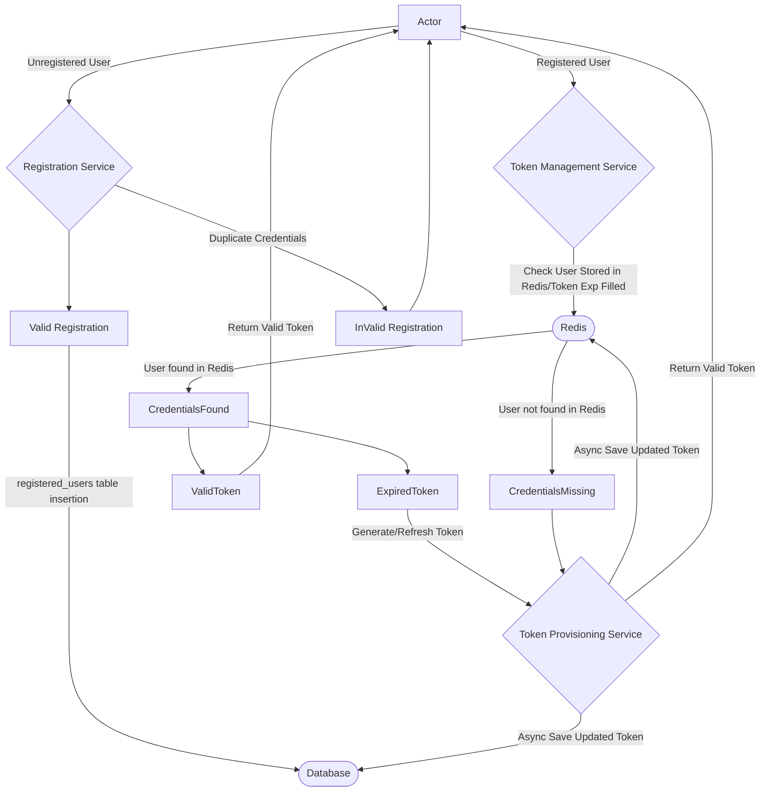

```mermaid
flowchart TD
    Actor
    Database([Database])
    Redis([Redis])
    RegistrationService{Registration Service}
    TokenManagementService{Token Management Service}
    TokenProvisioningService{Token Provisioning Service}
    Valid[Valid Registration]
    InValid[InValid Registration]
    
    Actor -->|Unregistered User| RegistrationService
    RegistrationService --> Valid
    RegistrationService -->|Duplicate Credentials| InValid
    InValid --> Actor
    Valid -->|registered_users table insertion| Database

    Actor -->|Registered User| TokenManagementService
    TokenManagementService -->|Check User Stored in Redis/Token Exp Filled| Redis
    Redis -->|User found in Redis| CredentialsFound
    CredentialsFound --> ExpiredToken
    CredentialsFound --> ValidToken
    ExpiredToken -->|Generate/Refresh Token| TokenProvisioningService
    TokenProvisioningService -->|Async Save Updated Token| Database
    TokenProvisioningService -->|Async Save Updated Token| Redis
    TokenProvisioningService -->|Return Valid Token| Actor
    ValidToken --> |Return Valid Token| Actor
    Redis -->|User not found in Redis| CredentialsMissing
    CredentialsMissing --> TokenProvisioningService
```