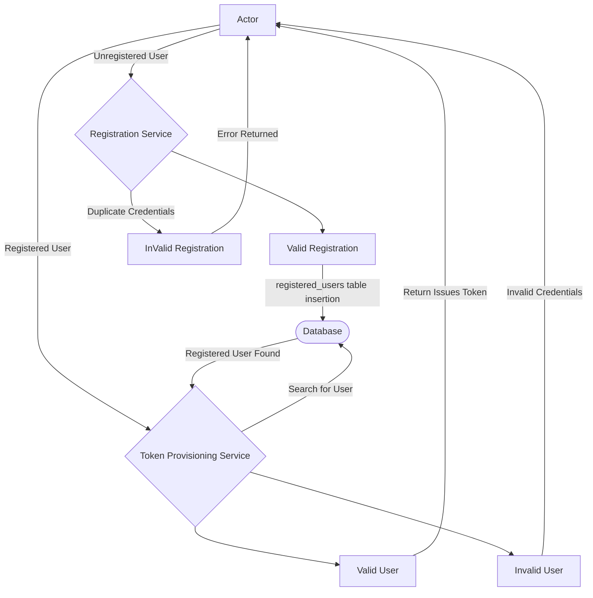

```mermaid
flowchart TD
    Actor
    Database([Database])
    RegistrationService{Registration Service}
    TokenProvisioningService{Token Provisioning Service}
    Valid[Valid Registration]
    InValid[InValid Registration]
    
    Actor -->|Unregistered User| RegistrationService
    RegistrationService --> Valid
    RegistrationService -->|Duplicate Credentials| InValid
    InValid -->|Error Returned| Actor
    Valid -->|registered_users table insertion| Database
    
    Actor -->|Registered User| TokenProvisioningService
    TokenProvisioningService -->|Search for User| Database
    Database -->|Registered User Found| TokenProvisioningService
    TokenProvisioningService --> ValidUser[Valid User]
    TokenProvisioningService --> InvalidUser[Invalid User]
    InvalidUser -->|Invalid Credentials| Actor
    ValidUser -->|Return Issues Token| Actor
```